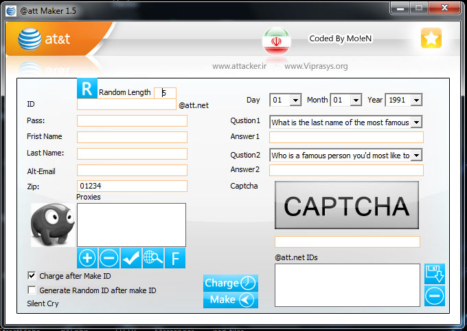



## name@att\.net Yahoo\!ID Maker Ver1\.5

### Description

this is @att.net ID Maker! this program make @att.net IDs(bots for Yahoo!Tools &amp; Booters) with High Speed (6/Min) and also that need USA IP

I Put Proxy Setting! u can Set a USA IP a Proxy And Start to Make @att.net IDs

(NOTE: IDs Can Be Like This too l

----

Name

----

@att.net)
 
### More Info
 

             |
---                |---
**Submitted On**   |2010-02-13 05:20:14
**By**             |[ic0der](https://github.com/Planet-Source-Code/PSCIndex/blob/master/ByAuthor/ic0der.md)
**Level**          |Beginner
**User Rating**    |5.0 (15 globes from 3 users)
**Compatibility**  |VB 6\.0
**Category**       |[Internet/ HTML](https://github.com/Planet-Source-Code/PSCIndex/blob/master/ByCategory/internet-html__1-34.md)
**World**          |[Visual Basic](https://github.com/Planet-Source-Code/PSCIndex/blob/master/ByWorld/visual-basic.md)
**Archive File**   |[name@att\_n218033562010\.zip](https://github.com/Planet-Source-Code/ic0der-name-att-net-yahoo-id-maker-ver1-5__1-73118/archive/master.zip)

